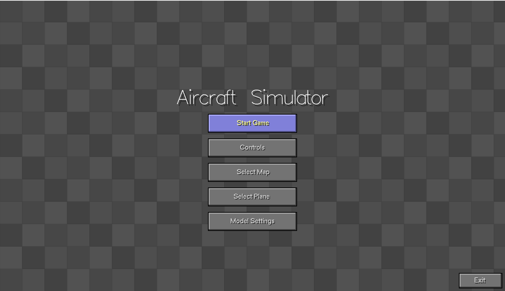
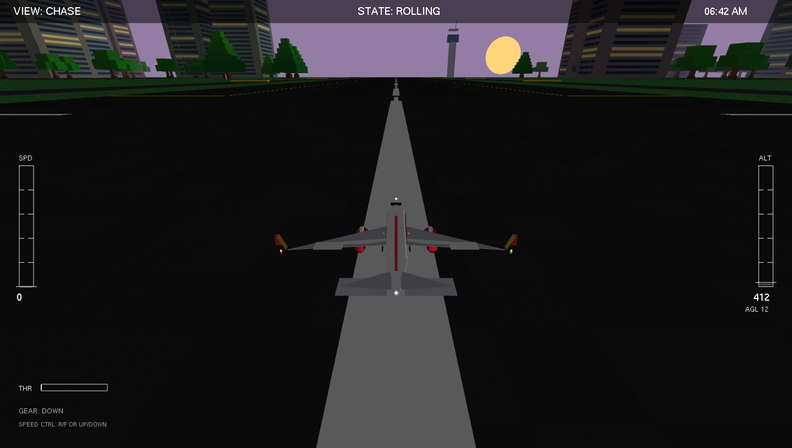
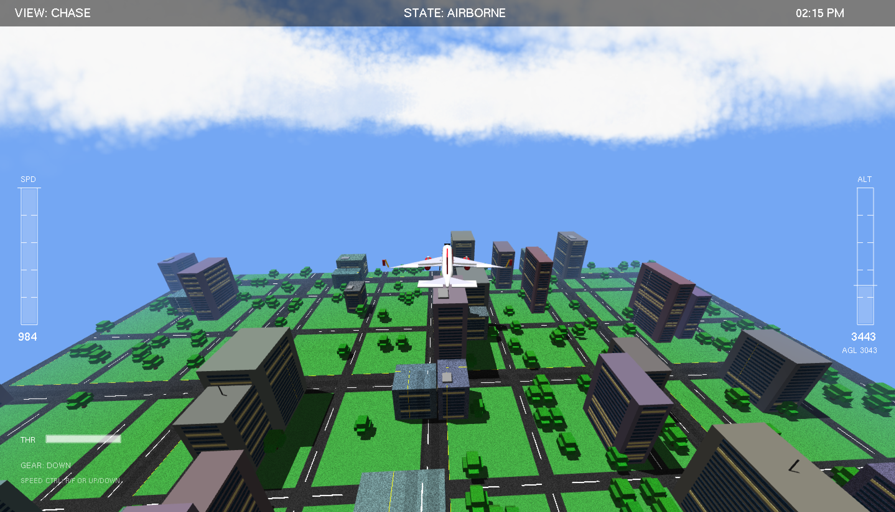
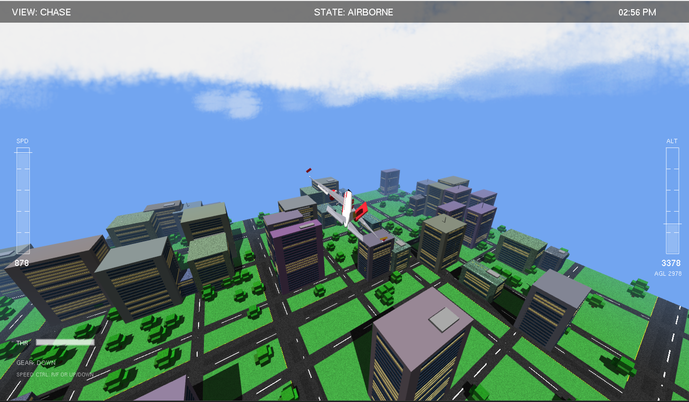
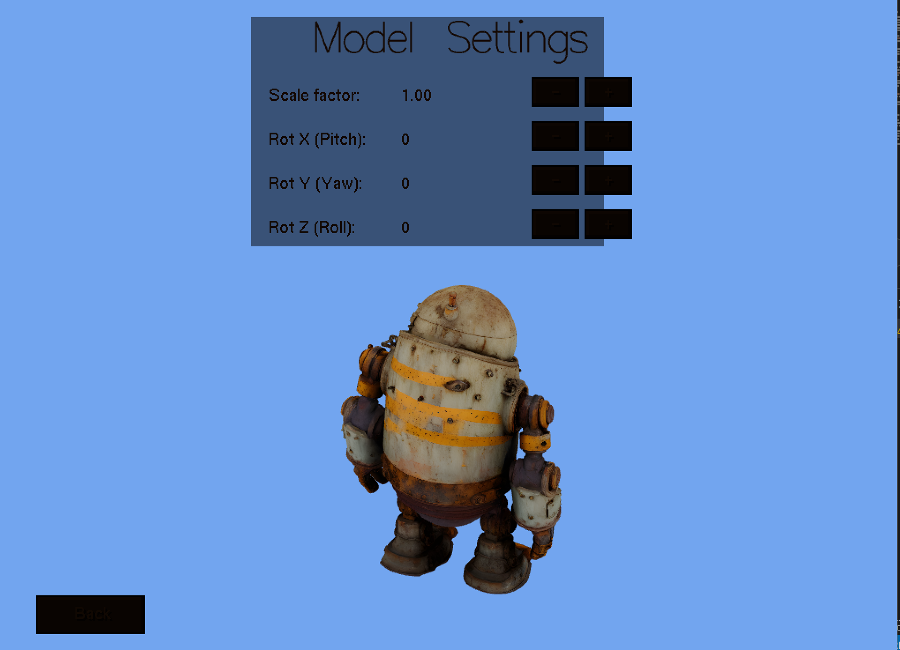
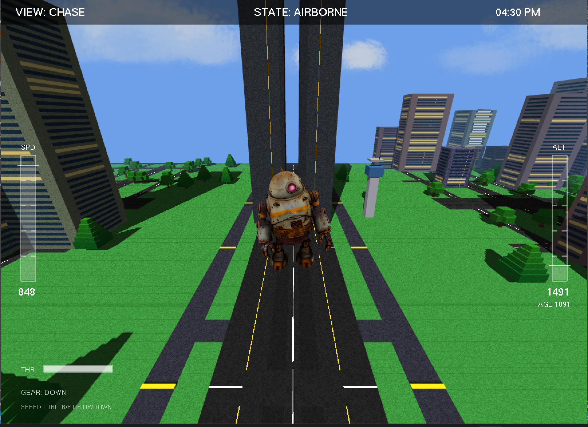
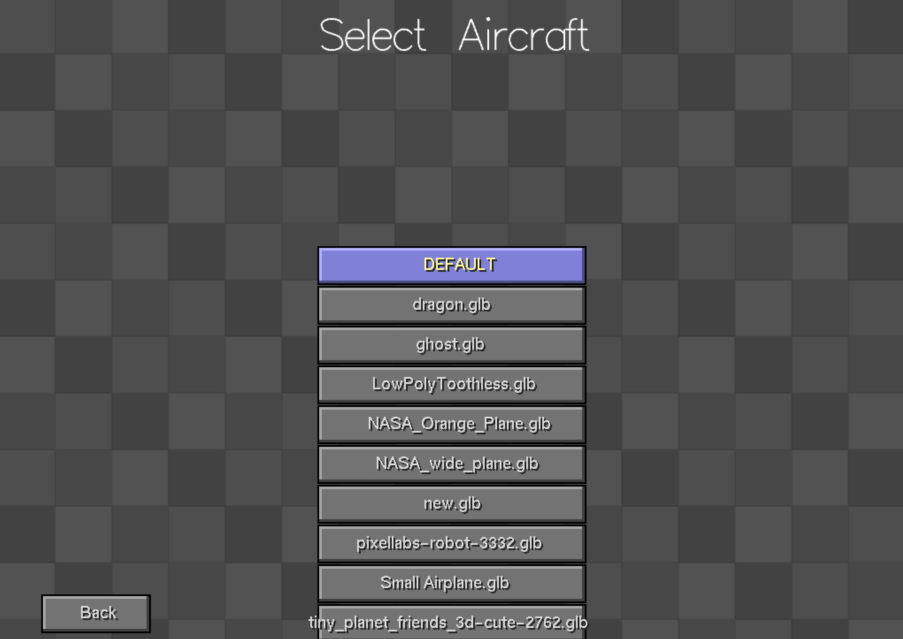
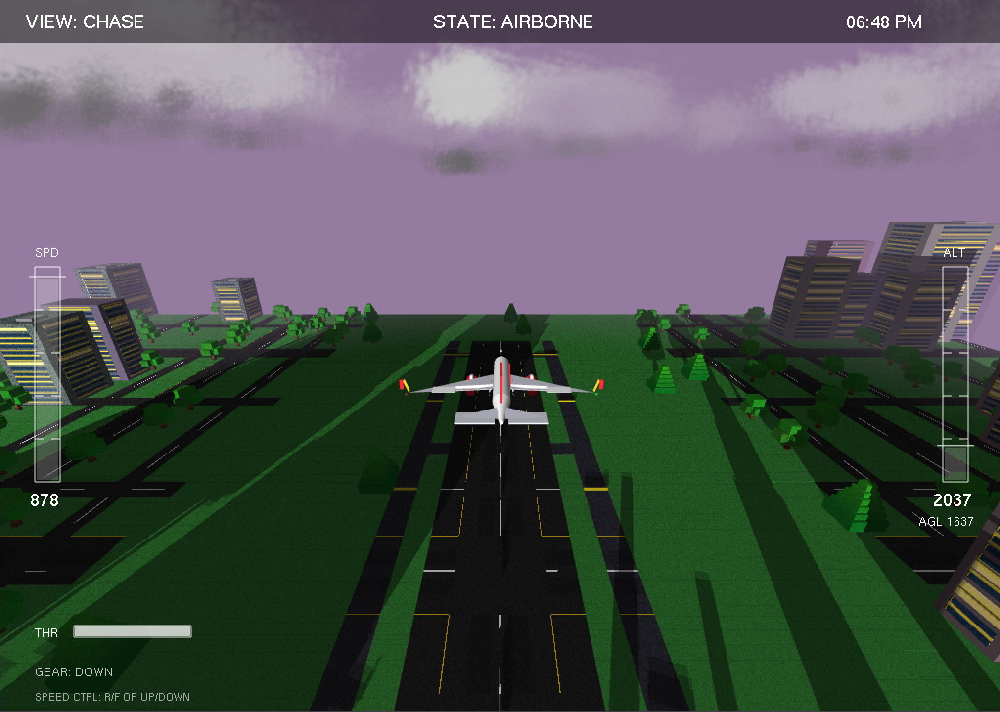
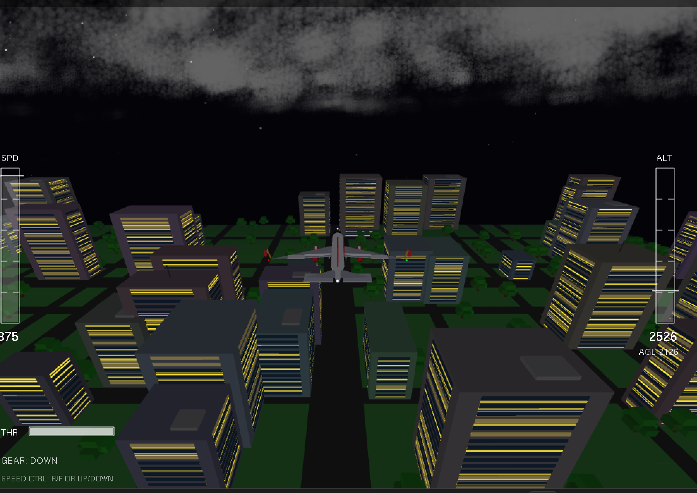

# Aircraft Simulator 🛫

A comprehensive C++ and OpenGL-based flight simulator featuring custom shaders, physics, atmospheric rendering, and full gamepad support.

[](https://opensource.org/licenses/MIT)
[](https://isocpp.org/)
[](https://www.opengl.org/)

---

## 📸 Gallery

<p align="center">
  
  
  
</p>
<p align="center">
  
  
  
</p>
<p align="center">
  
  
  
</p>

## 🎥 Gameplay Demo

<video src="https://github.com/user-attachments/assets/github-video-placeholder" controls="controls" width="100%">
  Your browser does not support the video tag.
</video>

> **Note**: *You can attach the actual video (`Aircraft_Demo.mp4`) directly inside GitHub by clicking "Edit" on the README.md in the GitHub web UI, deleting the video placeholder tag above, and dragging the video file directly into the editor. GitHub will host it automatically on their `user-attachments` CDN, bypassing the 100MB repository limit.*

---

## ✨ Features

- **Advanced Flight Physics**: Realistic pitch, yaw, roll, and throttle mechanics. Features dynamic landing sequences, including crash detection if you attempt a belly landing with your gear up.
- **XInput Gamepad Support**: Plug-and-play support for Xbox controllers, featuring smooth analog stick handling and deadzone management.
- **Custom Shader Pipeline**: Hybrid rendering combining legacy fixed-function operations with modern vertex and fragment shaders for depth, atmospheric scattering, and lighting.
- **Dynamic Terrain & Sky**: Procedurally generated environments, skyboxes, and atmospheric fog integrating with the time of day.
- **Assimp Model Loading**: Support for loading complex 3D aircraft models seamlessly into the graphics pipeline.
- **Modular Architecture**: Clean, scalable, decoupled codebase segregating physics, rendering, UI, and world rules.

---

## 📂 Project Structure

Following a recent architecture overhaul, the codebase is divided into clear functional domains:

```text
├── bin/          # Compiled executables and required DLLs
├── core/         # Core engine loops, math utilities, and state globals
├── docs/         # Deep-dive architecture and execution documentation
├── flight/       # Flight physics logic, Jet rendering, and Camera handling
├── graphics/     # Shader compilation, model loaders (Assimp), and shadows
├── planes/       # 3D Jet models and configuration text files
├── shaders/      # GLSL Vertex and Fragment shaders
├── tests/        # Internal modular tests (e.g., XInput testing)
├── ui/           # Heads-Up Display (HUD) and Main Menu rendering
└── world/        # Environment elements: Atmosphere, Sky, and Terrain
```
*(For a deeper dive into the system logic, refer to `ARCHITECTURE.md` and `docs/EXECUTION_INSTRUCTIONS.md`)*

---

## 🛠️ Prerequisites & Building

This project is configured to be built on Windows using the **MSYS2 (MinGW-w64)** environment.

### Dependencies
- **GCC / G++**: C++ compiler
- **Make**: Build automation
- **FreeGLUT**: Window and context management
- **Assimp**: 3D model importing
- **XInput**: Gamepad controller API (Windows native)

### Build Instructions

1. Open your **MSYS2 MinGW 64-bit** terminal.
2. Navigate to the project directory:
   ```bash
   cd /c/path/to/your/Aircraft_Simulator/curr
   ```
3. Compile the project using explicitly configured Makefiles:
   ```bash
   make clean
   make
   ```
4. Run the generated executable:
   ```bash
   ./bin/voxel_flight.exe
   ```

*(Alternatively, you can build directly via the integrated `Makefile` using your preferred IDE task runner).*

---

## 🎮 Controls

### Keyboard
| Action | Key |
| :--- | :--- |
| **Throttle Up / Down** | `W` / `S` |
| **Pitch Up / Down** | `Up Arrow` / `Down Arrow` |
| **Roll Left / Right** | `Left Arrow` / `Right Arrow` |
| **Yaw Left / Right** | `A` / `D` |
| **Toggle Landing Gear** | `G` |
| **Change Camera View** | `C` |
| **Pause/Menu** | `Esc` |

### Gamepad (Xbox Controller)
| Action | Controller Input |
| :--- | :--- |
| **Throttle Up / Down** | `Right Trigger (RT)` / `Left Trigger (LT)` |
| **Pitch & Roll** | `Right Stick (Y-axis)` & `Left Stick (X-axis)` |
| **Yaw Left / Right** | `Left Bumper (LB)` / `Right Bumper (RB)` |
| **Toggle Landing Gear** | `D-Pad Down` |
| **Change Camera View** | `Y Button` |
| **Pause/Menu** | `Start Button` |

*(Refer to the in-game Controls menu for a complete and up-to-date mapping).*


---

## 📝 License

Distributed under the MIT License. See `LICENSE` for more information.
